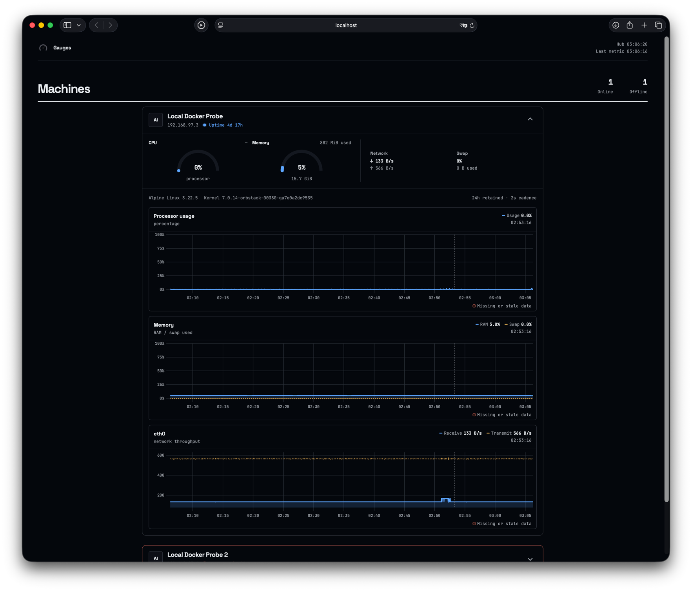

# Gauges

Gauges is a tiny home-lab dashboard: roughly “neofetch through `watch`, but for
all the Linux boxes on the LAN.” It favors a small understandable deployment
over an enterprise monitoring stack.



> [!NOTE]
> This project contains AI-generated code. See [AI_USAGE.md](AI_USAGE.md) for details.

It has two runtime targets and one shared Rust protocol module:

- **probe** — a Rust Linux daemon that samples every 10 seconds, buffers a
  configurable number of hours in local redb storage, and retries the hub after
  failure;
- **hub** — a Rust/Axum collector with a configured device/token map and a
  throw-away redb history whose range is configured independently by each
  probe. It serves the compiled Console from the same process and image;
- **shared** — the Serde wire models and validation used by both Rust targets.

The Console is a read-only Svelte dashboard that lazily polls visible cards in
batches and draws each machine's configured retained history. It has no
separate production runtime, WebSockets, login, or client actions.

The redb cutover intentionally does not migrate previous SQLite Hub history or
Probe outboxes. New deployments start with fresh embedded stores.

All durations are defaults, not constants. Probe timing can be set in TOML or
environment variables. `retention_hours` is a positive integer on each probe
and controls both its offline outbox and that machine's hub/console history.
The console refreshes every five seconds by default; `?poll=2` changes that
browser page to a two-second refresh without changing any probe's cadence.

## Run everything locally

The standalone local stack includes a probe with matching development
credentials, so no `.env` setup is needed:

```bash
docker compose -f compose.local.yaml up --build
```

Open `http://localhost:8080`. The development probe samples every two seconds
and enables virtual network interfaces so its container `eth0` appears in the
dashboard. Override the local ports or timing when needed, for example:

```bash
HUB_HTTP_PORT=33000 \
PROBE_COLLECTION_INTERVAL_SECONDS=10 \
PROBE_RETENTION_HOURS=168 \
docker compose -f compose.local.yaml up --build
```

To exercise the multi-machine accordion with two independent probe databases:

```bash
docker compose -f compose.local.yaml --profile multi up --build
```

This validates the complete probe → hub → console pipeline, offline redb
buffering, and polling UI. It reports the Linux container/VM namespaces, not
the macOS host; host disks, physical NICs, hwmon, RAPL, AMD DRM, and NVIDIA NVML
are therefore not expected to appear.

Stop the stack while preserving its local history with `Ctrl-C`, or remove its
test containers and both data volumes with:

```bash
docker compose -f compose.local.yaml down -v
```

## Start Gauges

Docker is the only supported hub/console deployment:

```bash
cp .env.example .env
# Edit device ids, names, and tokens in .env.
docker compose up --build
```

Open `http://localhost:8080`. The dashboard and Probe ingest API share that port.

## Install a probe

Build on a Linux machine for its native target:

```bash
# Debian/Ubuntu build dependency for btrfs-uapi's generated kernel bindings:
sudo apt-get install clang libclang-dev linux-libc-dev
cargo build --locked --release -p gauges-probe
sudo install -m 0755 target/release/gauges-probe /usr/local/bin/
sudo install -d /etc/gauges
sudo install -m 0600 probe/probe.example.toml /etc/gauges/probe.toml
sudo install -m 0644 deploy/gauges-probe.service /etc/systemd/system/
sudo systemctl enable --now gauges-probe
```

For a release asset, use `x86_64-unknown-linux-gnu` on an ordinary glibc Linux
host. NVIDIA metrics require this GNU-linked build because `nvml-wrapper`
dynamically loads the driver's glibc `libnvidia-ml.so.1`. The static musl
artifacts are for OpenWrt, Alpine-style systems, and deployments that do not
need NVIDIA metrics.

The packaged systemd unit runs as root so it can read protected hwmon, RAPL,
and GPU counters on distributions that restrict those files. Its filesystem,
home, kernel, device, and privilege surfaces are otherwise constrained with
systemd sandboxing; the probe never accepts inbound connections or commands.

Every TOML property has an environment equivalent. For a stateless container,
the minimum configuration is:

```bash
DEVICE_ID=nas \
TOKEN=replace-me \
HUB_URL=http://192.168.1.10:8080 \
DATABASE_PATH=/data/probe.redb \
gauges-probe
```

Persist `DATABASE_PATH`; otherwise a container restart necessarily
loses the offline outbox.

`LOG_LEVEL` controls Rust tracing independently of TOML and defaults to
`error`. Set it to `info` for startup, readiness, and upload lifecycle logs.

The probe image is useful for packaging and container telemetry, but an
ordinary container sees its own mounts/network namespace and may not have
access to host hwmon, RAPL, DRM, or NVML. The shipped Alpine image is musl-based
and therefore intentionally does not support NVIDIA NVML. Install the GNU-linked
binary as a host service when the goal is to monitor the Linux host itself.

A future host-monitoring container should follow the node-exporter boundary:
join the host PID, network, and UTS namespaces; bind host `/proc`, `/sys`,
`/etc/os-release`, and `/` read-only under `/host`; translate mount points through
that host root; and keep the container read-only with all capabilities dropped.
NVIDIA additionally needs a glibc image plus the NVIDIA container runtime's
read-only device/library injection. Do not use `privileged`. The current
collectors are not all root-path aware yet, so mounting `/host` alone is not a
supported host-monitoring mode.

## OpenWrt

The probe avoids glibc, OpenSSL, systemd, and shelling out to desktop tools.
Release binaries should be built for the router's exact musl architecture:

```bash
cargo install cross --locked
cross build --locked --release -p gauges-probe --target aarch64-unknown-linux-musl
# Also supported by upstream Rust/cross for common routers:
# x86_64-unknown-linux-musl, armv7-unknown-linux-musleabihf
```

Copy the binary to `/usr/bin/gauges-probe`, the example TOML to
`/etc/gauges/probe.toml`, and [the procd service](deploy/openwrt/gauges-probe.init)
to `/etc/init.d/gauges-probe`. Then run:

```sh
chmod +x /etc/init.d/gauges-probe
/etc/init.d/gauges-probe enable
/etc/init.d/gauges-probe start
```

OpenWrt hardware is unusually varied. Match the target to `ubus call system
board`; devices on unsupported MIPS targets require the OpenWrt SDK rather than
a generic prebuilt Rust binary. DSA ports that do not expose a sysfs `device`
entry can be selected explicitly with `network_include = ["wan", "lan1"]`.

## Metrics and intentional limits

Currently collected:

- aggregate CPU utilization and best available CPU/package temperature;
- actual RAM, available RAM, and swap;
- proven local storage owners' total/used bytes, excluding boot filesystems,
  container overlays, bind mounts, memory filesystems, network mounts, and
  pseudo filesystems by default; ordinary partitions roll up to their whole
  block device while the fullest contained filesystem remains visible;
- mounted Btrfs filesystems once per UUID, with explicit logical usable and raw
  member capacity, allocation profiles, and read-only allocation/device-error
  ioctls on GNU Linux; a root partition rolls up to its whole backing disk,
  while a multi-device pool contributes its logical usable capacity;
- UBIFS volumes with UBI eraseblock health and backing NAND ECC/bad-block
  counters read directly from sysfs on OpenWrt;
- byte totals and calculated rates for physical NICs (or explicit overrides);
- AMD/Intel DRM utilization, VRAM, and temperature when sysfs exposes them;
- NVIDIA utilization, VRAM, and temperature through the driver's NVML library;
- aggregate package power from Linux RAPL energy counters when readable;
- uptime as a serial metric;
- distro, version, kernel, hostname, current local IP, and detected GPU types
  in the handshake data.

SMART health is not in v1. It normally requires the privileged `smartctl`
command, would be expensive to invoke every 10 seconds, and is not consistently
present on OpenWrt. Its absence never blocks the common metrics pipeline.

Storage filtering reads Linux mount metadata from `/proc/self/mountinfo` and
normally requires a matching `/sys/dev/block/<major>:<minor>` entry. Btrfs uses
anonymous mount device numbers, so its `/dev/...` source is instead verified
through `/sys/class/block`; pool identity, members, and profiles come from
`/sys/fs/btrfs`, while `btrfs-uapi` avoids parsing command output for extended
GNU Linux metrics. UBIFS is resolved through `/sys/class/ubi` and
`/sys/class/mtd`; no external `ubinfo` process or UBIFS Rust library is needed.
Boot filesystems are omitted unless explicitly included. Exact TOML mount-point
filters remain available as `disk_include` and `disk_exclude` (exclude wins);
their environment equivalents are `DISK_INCLUDE` and `DISK_EXCLUDE`. Set
`local_filesystems_only = false` or `LOCAL_FILESYSTEMS_ONLY=false` to restore
sysinfo's broad mounted-filesystem list. `PROC_ROOT` and `SYS_ROOT` exist
primarily for collector layouts and tests; `ETC_ROOT` selects the directory
containing host `os-release`.

See [the architecture](docs/architecture.md) and [protocol](docs/protocol.md)
for the storage and API contracts.

## Security boundary

Ingest is authenticated per device. Read APIs and the console are deliberately
public and may reveal hostnames, IP addresses, kernel versions, utilization,
and mount names. Bind/publish Gauges only on a trusted internal network or put
your own authenticated reverse proxy in front of it. Gauges never executes
commands on probes and exposes no control API.
